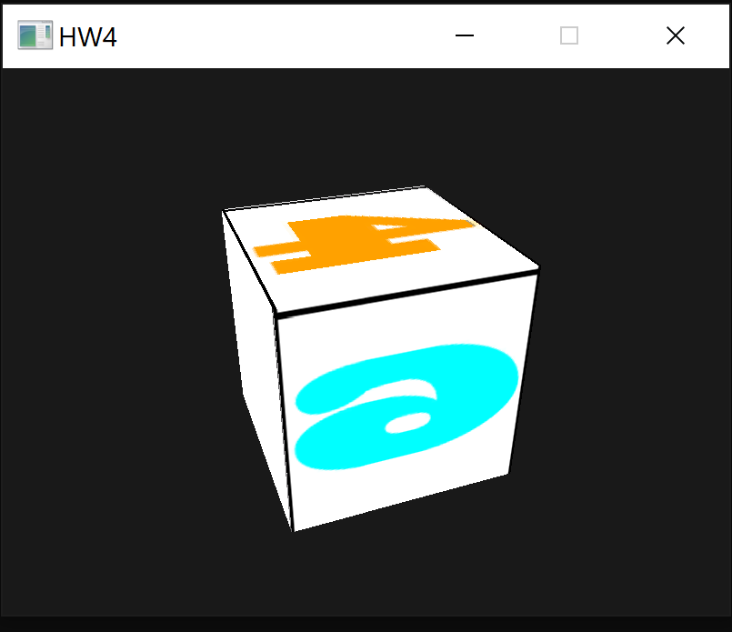
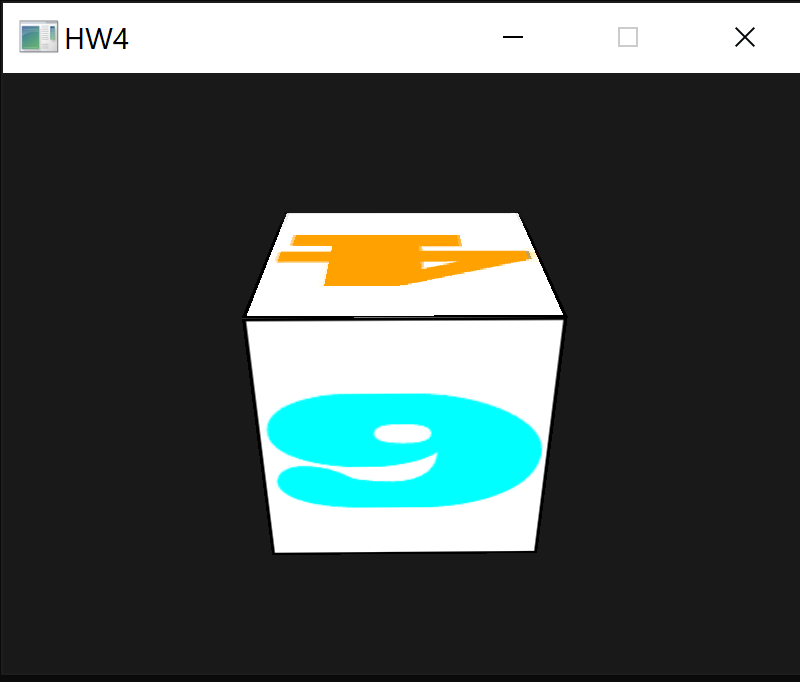
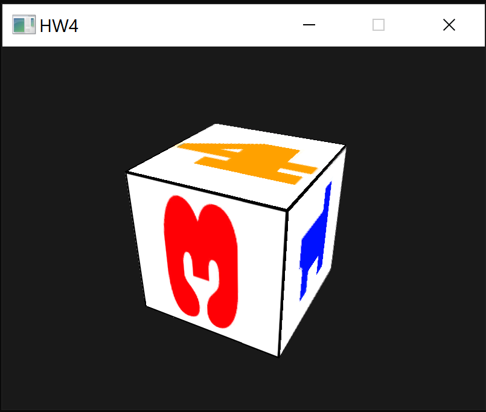

# Homework 4
### Author: Richard Paredes
### UHID: 1492535
### Course: COSC4370

## Directory contents:
- report.pdf: detailed report for HW4
- guidelines.pdf: HW4 guidelines and requirements
- hw4.exe: executable file for program (on Windows)
- output.png: screenshot of program output with same perspective as guidelines
- output2.png: screenshot of program output with same perspective as guidelines, altered UV vertices
- output3.png: screenshot of program output with alternate perspective
- Makefile: for compiling main.cpp on MacOS/Linux
- Dependencies: used by Visual Studio solution project for compilation
- Source code for the program:
  main.cpp, Shader.h, texture.frag, texture.vs

#### To build and execute on Windows using Visual Studio:
> Open this HW4 directory as a solution project using Visual Studio. Once opened, build and execute the project with a build configuration of Debug and target x86.

#### To execute on Windows without Visual Studio
> Execute the HW4.exe file

## Program output:
- A window containing a scene with a rotating cube using the texture mapped from texture.dds
  > **Texture mapped using Original UV data:**
  >

  > **Texture mapped after removing inversion of UV data:**
  >
  >